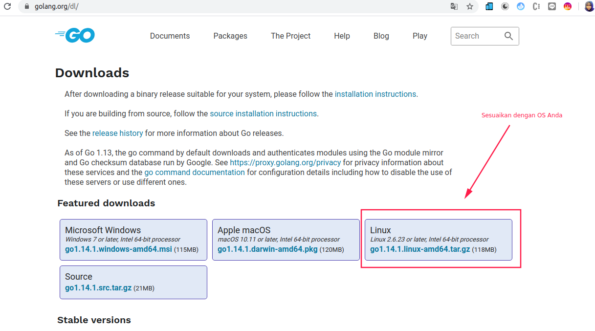
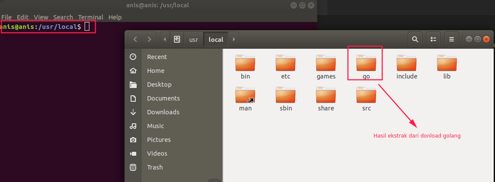
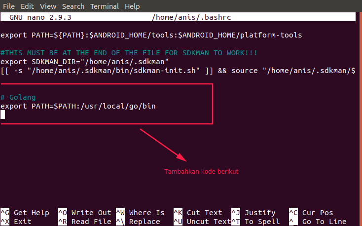
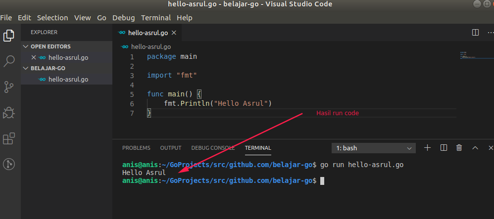

# Cara Install Go

Untuk install go, silahkan download memalui situs resmi di https://golang.org/ dan kemudian klik tombol download, sehingga diarahkan ke halaman download.



Jika sudah selesai download, copy file tersebut dan paste di folder `/usr/local` kemudian ekstrak file download tersebut sehingga hasilnya seperti berikut.



> Ingat baik-baik letak folder go di ekstrak, karena akan ditambahkan sebagai PATH sehingga terminal pada device Anda dapat mengetahui adanya instalan go.

Buka file `.bashrc` atau `.bash_profile`, bebas mau pilih yang mana tapi saya sarankan pakai `.bashrc` agar berlaku untuk semua sesi terminal. Gunakan perintah berikut.

```bash
sudo nano ~/.bashrc
```

Kemudian tambahkan PATH yang mengarah ke letak go diekstak. Pada kasus ini saya meletakkan go di `/usr/local/go` sehingga menjadi:

```bash
export PATH=$PATH:/usr/local/go/bin
```

Perhatikan gambar berikut.


Setelah ditambahkan, simpan dan lakukan refresh path dengan perintah berikut.

```bash
source ~/.bashrc
```

# Hello Asrul

Untuk memastikan bahwa kita telah berhasil melakukan install go, mari cek versi yang terinstal dengan perintah berikut.

```bash
go version
```

Jika muncul versi go yang terinstall, misal saya dengan versi `go version go1.14 linux/amd64
` maka instalasi berhasil.

Tidak sabar mencoba kode pertama saya. Ayo membuat sebuah file dengan nama `halo-asrul.go`, kemudian isikan kode berikut.

```go
package main

import "fmt"

func main() {
    fmt.Println("Hello Asrul")
}
```

Jalankan dengan cara `go run nama-file.go`, perhatikan gambar berikut.


> n/b: fmt adalah package bawaan go untuk proses Input Output (I/O) dalam format analog,https://golang.org/pkg/fmt