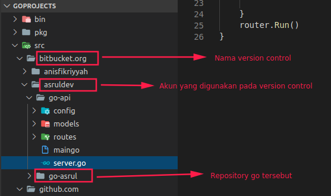
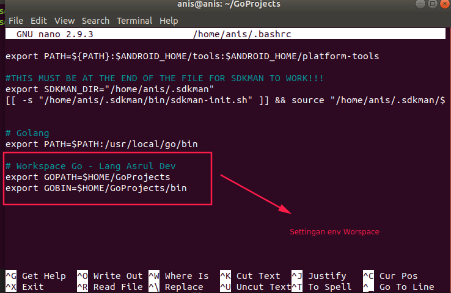

# Workspace Go

Struktur folder yang digunakan go sangat berbeda dengan bahasa pemrograman lain, karena go sendiri memberikan saran penataan workspase. Pada bahasa pemograman lain misal NodeJS, Anda bebas meletakkan folder proyek dimanapun dan tidak ada anjuran oleh NodeJS sendiri.

Berikut penyusunan folder yang disarankan oleh GO. Pada folder `home`, ada folder `GoProjects` yang isinya ada 3 folder, yaitu `bin`, `package`, dan `src`. Folder proyek atau repository disarankan dibawah folder version control (misal: github.com atau bitbucket.com) dan nama akun version control (nisal: asruldev).

Perhatikan gambar berikut.



Pada gambar terlihat susunan yang disarankan oleh go, itu disarankan oleh go agar mempermudah para developer menata proyak yang digunakan.

Setelah penyusunan struktur folder tersebut, perlu dilakukan setting environtment sehingga go dapat mengetahui workspace yang disusun dengan menambahkan perintah berikut pada file `.bashrc`

```bash
export GOPATH=$HOME/GoProjects
export GOBIN=$HOME/GoProjects/bin
```



Setalah ditambahkan jalankan perintah untuk reload atau refresh dengan cara berikut.

```
source ~/.bashrc
```
