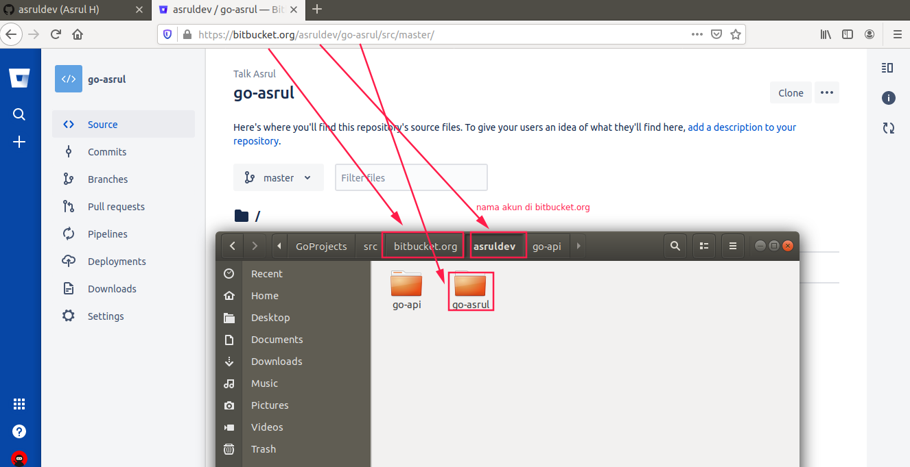
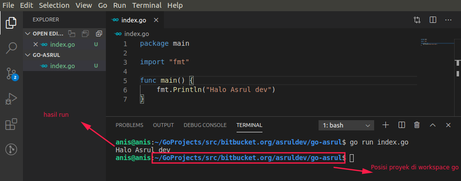

# Proyek Baru

Sekarang mari membuat sebuah proyek baru, pada kasus ini saya menggunakan bitbucket.org, akun yang saya gunakan di bitbucket dengan username `asruldev` dan membuat proyek dengan repository `go-asrul`. Silahkan diimplementasikan sesuai workspace go yang telah kita bahas sebelumnya. Clone repository tersebut ke worspace go sehingga akan menjadi seperti gambar berikut.



Buat file baru dengan nama `index.go` dan isinya seperti berikut.

```go
package main

import "fmt"

func main() {
	fmt.Println("Halo Asrul dev")
}
```
Perhatikan gambar berikut.

