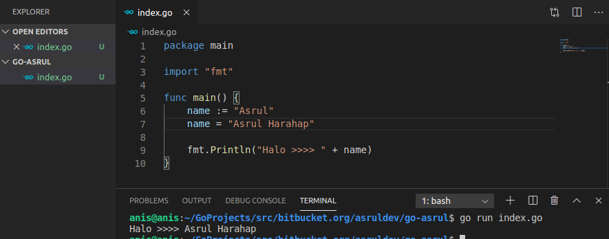

# Variable Go

Semua bahasa pemprograman (go, Javascript, php, dll) , memiliki variable untuk menyimpan data. Sehingga data dapat dipanggil berkali-kali, dimanipulasi dll.

Pada go variable dapat ditulis dengan beberapa cara, perhatikan contoh berikut.

## Deklarasi variable
Variable diawali keyword `var` kemudian nama variable dan tipe data, lalu nilai variable dipisahkan dengan tanda sama dengan (=).

## Deklarasi Singkat
Cara singkat menulis varibale di go dengan tanda :=, pada sebelah kiri adalah nama variable dan sebelah kanan adalah nilai variable.

## Mengubah nilai Variable
Pada go mirip dengan bahasa pemrograman lain, sebuah variable dapat diubah nilainya dengan cara menuliskan nama variable dan nilai setelah tanda sama dengan.
Perhatikan gambar berikut.

## Variable Konstan
Variable dengan keyword `const` adalah variable kontanta yang nilainya tetap dan tak bisa diubah.

## Scope Variable
Pada go ada 2 jenis scope variable yaitu local dan global. Variable local hanya dapat dipanggil dalam fungsi itu sendiri dan boleh menuliskannya menggunakan tanda (:=), dan variable global dituliskan diluar function sehingga dapat dipanggil dari function manapun dan tidak dapat ditulis menggunakan tanda (:=).